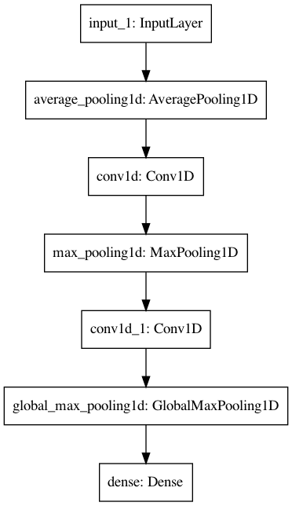

# Emergency Detect

## Description

### Model Architecture



## Setup

1. Download Dataset

```shell
./download_dataset.sh
```

2. Generate Tensorflow Lite file

```shell
python main.py
```

### Datasets

- joey_sound

## Contributes

<a href="https://github.com/Coolshanlan">Coolshanlan</a>
<span>&nbsp;/&nbsp;</span>
<a href="https://github.com/dj6082013">David Day</a>
